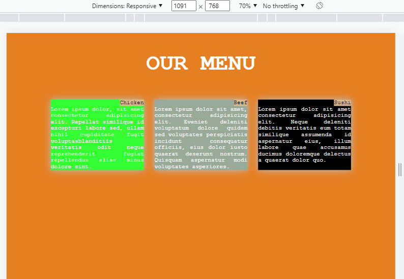

# mod-1.github.io
A Responsive Web Page Example

Its shows how the content will look on th diff-diff devices like Laptops, Mobiles, Tables.
How the content changes its width, position, size etc.

PIC:1--Desktop Screen

PIC:2-- MAX Width

PIC:2-- Table Screen

PIC:2-- Mobile Screen
